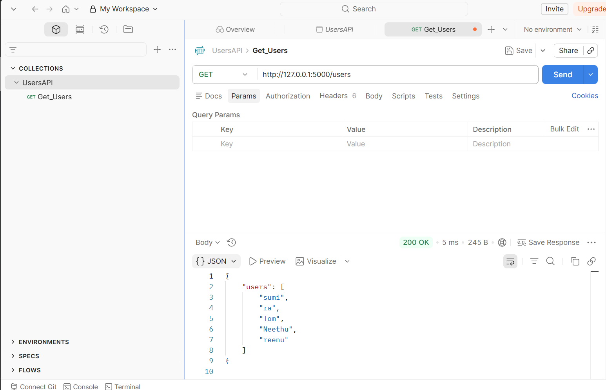
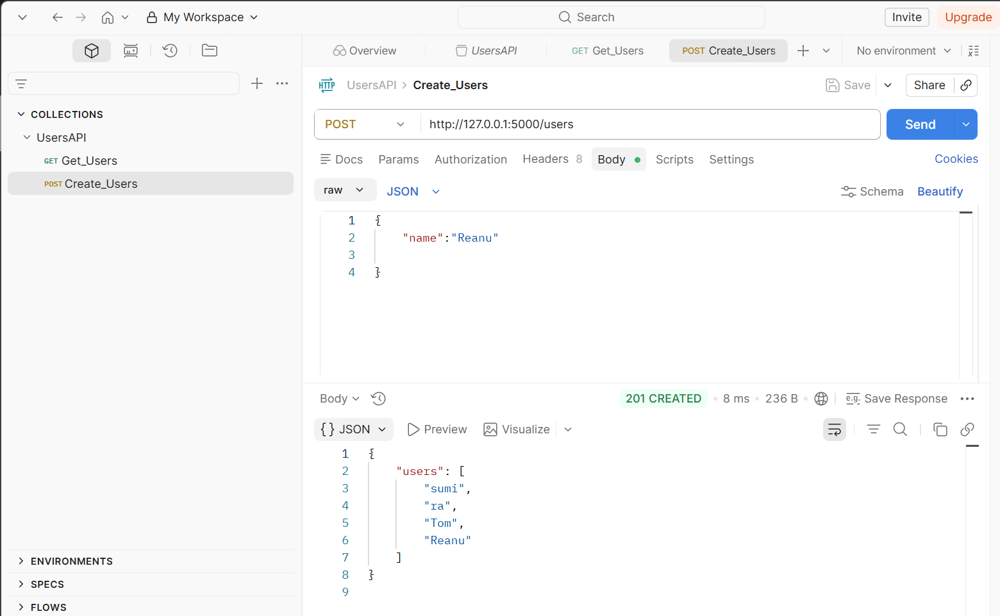

# Flask Celebration API
This is a Flask API that uses the Agify API and the Genderize API to predict the age and gender of a given name. 

[Age Rest API][https://agify.io/documentation]
[Gender Rest API][https://genderize.io/documentation]
response in Flask:
Testing with Postman

## Testing API with REST.client VS Code Extension
[REST.client VS Code Extension](https://marketplace.visualstudio.com/items?itemName=humao.rest-client) allows you to send HTTP request and view the response in Visual Studio Code directly. It is a great tool for testing APIs by sending the requests stored in a file with usually a `.http` extension. You can send the requests by clicking "Send Request" button on top of the file. The output will be displayed in the output panel in VS Code. 

Our test file is [api.rest](api.rest). It contains the following requests:
1. Get all users
2. Create a new user
